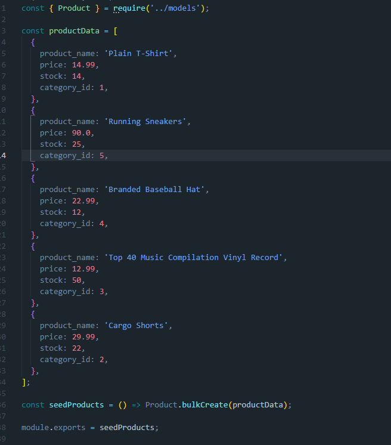

# E-Commerce Back End-Bryson Kern

https://youtu.be/_QGz8C_o_n4

## Description

For this assignment I created the back end for an E-commerce webpage. This project allows users to view, update, add, and delete categories, tags, and products. This portion of the website is important because it allows you to add or remove items from your store without hard coding it into your webpage every time something is added or dropped. My motivation behind this assignment was to make E-commerce easier to update and keep track of.

 - 
 - 

## Table of Contents 🧙

- [installation](#installation)
- [Usage](#usage)
- [Tests](#Tests)
- [Credits](#credits)
- [License](#license)
- [Questions](#Questions)

## Installation

In order to install this assignment you first download all my assets from gitHub. Once downloaded you will need to do "NPM I" to download all the dependencies. After that you will need to source the database by signing in the mysql and running "source schema.db. Then you will need to seed that database by running "npm run seed" Once those steps are finished you simply run "NPM start" and you are ready to go!

## Usage

To use this project one must first install insomnia. Once insomnia is installed you simply just add your route and do any kind of call you would like to make.

## Credits

- W3Schools - https://www.w3schools.com/
- MDN -https://developer.mozilla.org/en-US/
- LevelUp - https://levelup.gitconnected.com/database-seeding-in-node-js-2b2eec5bfaa1

## License

    Copyright 2022 Bryson Kern
    Permission is hereby granted, free of charge, to any person obtaining a copy of this software and associated documentation files (the "Software"), to deal in the Software without restriction, including without limitation the rights to use, copy, modify, merge, publish, distribute, sublicense, and/or sell copies of the Software, and to permit persons to whom the Software is furnished to do so, subject to the following conditions:

    The above copyright notice and this permission notice shall be included in all copies or substantial portions of the Software.

    THE SOFTWARE IS PROVIDED "AS IS", WITHOUT WARRANTY OF ANY KIND, EXPRESS OR IMPLIED, INCLUDING BUT NOT LIMITED TO THE WARRANTIES OF MERCHANTABILITY, FITNESS FOR A PARTICULAR PURPOSE AND NONINFRINGEMENT. IN NO EVENT SHALL THE AUTHORS OR COPYRIGHT HOLDERS BE LIABLE FOR ANY CLAIM, DAMAGES OR OTHER LIABILITY, WHETHER IN AN ACTION OF CONTRACT, TORT OR OTHERWISE, ARISING FROM, OUT OF OR IN CONNECTION WITH THE SOFTWARE OR THE USE OR OTHER DEALINGS IN THE SOFTWARE.

## Questions

Feel free to contact me with any questions or concerns!

- email: kernbryson@yahoo.com
- GitHub: https://github.com/kernbryson
